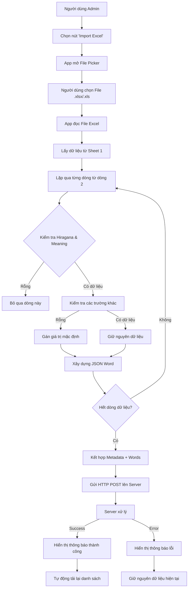

# 📊 ĐẶC TẢ VÀ PHÂN TÍCH TÍNH NĂNG IMPORT EXCEL TỪ A-Z (FLUTTER)

## 1. TỔNG QUAN TÍNH NĂNG (OVERVIEW)
- **Mục tiêu:** Cho phép User có quyền `ADMIN` tạo mới một Topic (Chủ đề học) cùng hàng loạt từ vựng bằng cách tải lên file Excel (`.xlsx`, `.xls`) trực tiếp từ điện thoại.
- **Vấn đề giải quyết:** Loại bỏ thao tác nhập liệu thủ công từng từ vựng tốn thời gian. App sẽ tự động đọc file Excel, loại bỏ dữ liệu lỗi, chuyển đổi thành JSON và gửi lên Server.
- **Backend Endpoint:** Tích hợp trực tiếp với API `POST /v1/topics/import` của hệ thống Node.js.

---

## 2. ĐẶC TẢ DỮ LIỆU (DATA SPECIFICATION)

Tính năng này kết hợp dữ liệu từ 2 nguồn: **Form UI** (Metadata) và **File Excel** (List từ vựng).

### 2.1. Nguồn 1: Form Metadata (Nhập trên App)
- `levelId`: ID của cấp độ (VD: N5, N4).
- `title`: Tên chủ đề (Bắt buộc).
- `orderIndex`: Thứ tự hiển thị của Topic (Mặc định: 1).

### 2.2. Nguồn 2: Định dạng File Excel (Đọc từ File)
App sẽ đọc dữ liệu từ **Sheet đầu tiên**, bắt đầu từ **Dòng 2 (Index 1)** (Bỏ qua Dòng 1 là tiêu đề cột).

| Cột Excel | Thuộc tính JSON | Bắt buộc | Kiểu dữ liệu | Quy tắc xử lý (Filtering Rule) |
| :--- | :--- | :--- | :--- | :--- |
| **A** (Index 0) | `kanji` | Không | String | Nếu trống -> Gán chuỗi rỗng `""` |
| **B** (Index 1) | `hiragana` | **CÓ** | String | ⚠️ **Nếu rỗng -> Bỏ qua toàn bộ dòng này** |
| **C** (Index 2) | `romaji` | Không | String | Nếu trống -> Gán chuỗi rỗng `""` |
| **D** (Index 3) | `meaning` | **CÓ** | String | ⚠️ **Nếu rỗng -> Bỏ qua toàn bộ dòng này** |
| **E** (Index 4) | `example` | Không | String | Nếu trống -> Gán chuỗi rỗng `""` |
| **F** (Index 5) | `audioUrl` | Không | String | Nếu trống -> Gán chuỗi rỗng `""` |

### 2.3. Định dạng Output (JSON Payload)
Sau khi hợp nhất Metadata và File Excel, App phải sinh ra Payload chính xác như sau để gửi lên BE:
```json
{
  "levelId": "N5",
  "title": "Từ vựng bài 1 Minna",
  "orderIndex": 1,
  "words": [
    {
      "kanji": "私",
      "hiragana": "わたし",
      "romaji": "watashi",
      "meaning": "tôi",
      "example": "私は学生です。",
      "audioUrl": ""
    }
  ]
}
## 3. CÁC BƯỚC THỰC HIỆN CHI TIẾT (STEP-BY-STEP IMPLEMENTATION)

### 3.1. Tích hợp File Picker (Chọn File)
- **Thư viện đề xuất:** `file_picker`.
- **Chức năng:** Mở giao diện chọn file của hệ thống Android/iOS.
- **Cấu hình:** Cho phép chọn định dạng `Excel` (XLS, XLSX).

### 3.2. Đọc và Giải mã File Excel (Excel Parsing)
- **Thư viện đề xuất:** `excel` hoặc `syncfusion_flutter_xlsio`.
- **Thao tác:**
    1. Mở File Excel đã chọn.
    2. Đọc dữ liệu từ **Sheet đầu tiên**.
    3. Bỏ qua dòng đầu tiên (Header).
    4. Lặp qua từng dòng tiếp theo để lấy dữ liệu.

### 3.3. Xử lý và Lọc Dữ Liệu (Validation & Cleaning)
**QUAN TRỌNG:** App phải tự động loại bỏ các dòng dữ liệu rác trước khi gửi lên Server.
- **Bước 1:** Kiểm tra cột `B` (Hiragana) và `D` (Meaning).
- **Bước 2:** Nếu cả hai cột này đều **rỗng** -> Bỏ qua dòng đó (Skip).
- **Bước 3:** Đối với các cột khác (Kanji, Romaji, Example, Audio), nếu rỗng -> Gán giá trị mặc định là chuỗi rỗng `""`.
- **Bước 4:** Loại bỏ các khoảng trắng thừa ở đầu và cuối mỗi chuỗi (Trim).

### 3.4. Gửi Dữ Liệu lên Server
- **Request Type:** `POST`.
- **URL:** `https://your-domain.com/api/v1/topics/import`.
- **Headers:**
    - `Authorization`: `Bearer <token>`.
    - `Content-Type`: `multipart/form-data`.
- **Body:** Gửi Payload JSON đã chuẩn bị ở Mục 2.3.

### 3.5. Xử lý Kết Quả (Response Handling)
- **Success (201 Created):**
    - Hiển thị thông báo thành công.
    - Tự động tải lại danh sách Topic (Gọi API `getAllTopics`).
    - Đóng Dialog.
- **Error:**
    - Nếu lỗi do Server (400, 500): Hiển thị thông báo lỗi trả về từ Server.
    - Nếu lỗi mạng (Timeout, Network Error): Hiển thị thông báo lỗi kết nối.

---

## 4. FLOW DIAGRAM (LUỒNG HOẠT ĐỘNG)


---

## 5. THIẾT KẾ GIAO DIỆN (UI DESIGN SKETCH)

### 5.1. Màn hình Topics Tab (Sau khi Import thành công)
- *Logic: Tự động Refresh danh sách và hiển thị dữ liệu mới vừa thêm vào.*